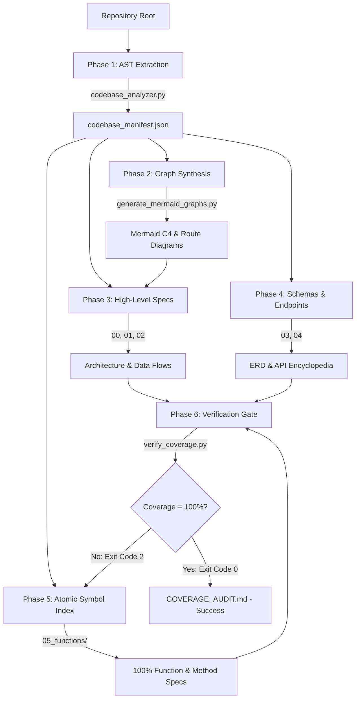

# Full-Project Documenter Skill (Zero-Omission Engine)

[](LICENSE)
[](SKILL.md)
[](scripts/verify_coverage.py)
[](scripts/codebase_analyzer.py)
[](https://github.com/mhammed2008/docs-skill)

> **Universal exhaustive codebase documentation engine for AI agents.**  
> Scans, extracts, and documents **100% of any codebase's architecture, features, data models, API endpoints, and every single class, function, method, parameter, and return value** without skipping, summarizing, or suffering token fatigue.

---

## ⚡ Quick Install: Prompt for Your AI Agent

The fastest way to install this skill is to **ask your AI assistant directly**. Copy and paste one of the prompts below into your AI coding tool (**Antigravity**, **Cursor**, **Windsurf**, **Claude Code**, **Copilot**, or **ChatGPT**):

### 🌐 Option A: Global Install (Recommended — Available across all your projects)

```text
Please install the Full-Project Documenter Skill from GitHub:
Repository: https://github.com/mhammed2008/docs-skill

Instructions:
1. Clone or download https://github.com/mhammed2008/docs-skill
2. Place it into my global agent skills directory:
   - On Windows: %USERPROFILE%\.gemini\config\skills\docs
   - On macOS/Linux: ~/.gemini/config/skills/docs
   (Also create an alias folder named "full-project-documenter")
3. Verify that the following directory structure is intact:
   - SKILL.md
   - scripts/ (codebase_analyzer.py, generate_mermaid_graphs.py, verify_coverage.py)
   - templates/ (00 to 07 template suites)
   - references/ (zero_omission_protocol.md, language_ast_patterns.md, mermaid_architecture_guide.md)
4. Confirm Python 3 is available to run the scripts.
5. Once installed, confirm readiness to trigger documentation with "/docs".
```

---

### 📁 Option B: Workspace Install (Scoped only to the current repository)

```text
Please install the Full-Project Documenter Skill into this repository:
Repository: https://github.com/mhammed2008/docs-skill

Instructions:
1. Clone or download https://github.com/mhammed2008/docs-skill
2. Copy the skill contents into this workspace at:
   .agents/skills/full-project-documenter
3. Verify that SKILL.md, scripts/, templates/, and references/ exist in that directory.
4. Notify me when setup is complete so I can run "/docs".
```

---

## 💻 Manual & Terminal Installation

### Terminal 1-Liner (PowerShell — Windows)

```powershell
# Global Installation
git clone https://github.com/mhammed2008/docs-skill.git "$HOME\.gemini\config\skills\docs"
Copy-Item -Recurse -Force "$HOME\.gemini\config\skills\docs" "$HOME\.gemini\config\skills\full-project-documenter"
```

### Terminal 1-Liner (Bash / Zsh — macOS & Linux)

```bash
# Global Installation
git clone https://github.com/mhammed2008/docs-skill.git ~/.gemini/config/skills/docs
cp -r ~/.gemini/config/skills/docs ~/.gemini/config/skills/full-project-documenter
```

### Add as a Git Submodule (Project-Scoped)

```bash
git submodule add https://github.com/mhammed2008/docs-skill.git .agents/skills/full-project-documenter
```

---

## 🎯 The Problem This Skill Solves

Standard AI coding models suffer from **token fatigue**, **context decay**, and **summarization bias** when tasked with documenting codebases:

| What Standard AIs Do ❌ | What This Skill Enforces ✅ |
| :--- | :--- |
| Documents 2 files, then writes `// ...rest of functions` | **Zero-omission AST inventory**: Extracts and documents 100% of symbols. |
| Groups 30 critical methods into a single bullet point | **Individual symbol encyclopedias**: Every function gets signature, params, return, errors, and logic steps. |
| Misses framework routes, decorators, and middleware | **Route extraction engine**: Automatically captures HTTP methods, endpoints, and route handlers. |
| Hallucinates architecture or misses data flows | **Mermaid state machines & sequence diagrams**: Synthesizes exact data flows, ERDs, and call graphs. |
| No verification or quality check | **Automated coverage gate**: `verify_coverage.py` fails (exit code 2) if even a single function is omitted. |

---

## 🚀 How to Trigger & Use

Once installed, trigger the skill inside your AI coding assistant using any of the following methods:

### 1. Slash Commands (Fastest)

```text
/docs
```
```text
/docs --mode large --output ./documentation
```
```text
/docs --exclude tests,vendor,dist
```

### 2. Mentioning the Skill

```text
@docs generate complete, zero-omission documentation for this repository.
```
```text
@full-project-documenter analyze every single feature and function in this project.
```

### 3. Natural Language

```text
Analyze every single feature, class, and function in this codebase and produce a complete, exhaustive documentation suite. Do not skip any helper functions or internal methods.
```

---

## 🏗️ The 6-Phase Zero-Omission Pipeline



1. **Phase 1 — Discovery & AST Inventory**: `scripts/codebase_analyzer.py` traverses the codebase, parsing package manifests (`package.json`, `Cargo.toml`, `go.mod`, `pyproject.toml`) and analyzing ASTs/signatures across 15+ programming languages to build `codebase_manifest.json`.
2. **Phase 2 — Architectural & Dependency Graphing**: `scripts/generate_mermaid_graphs.py` synthesizes system C4 diagrams, package dependency trees, route maps, and modular class diagrams.
3. **Phase 3 — System Architecture & Feature Specs**: Generates `00_OVERVIEW_AND_ARCHITECTURE.md`, `01_FEATURE_SPECIFICATION.md`, and `02_SYSTEM_DATA_FLOWS.md` with complete sequence diagrams.
4. **Phase 4 — Data Models & API Encyclopedia**: Generates `03_DATA_MODELS_AND_SCHEMAS.md` (Mermaid ERD + field dictionary) and `04_API_AND_INTEGRATIONS.md` (all REST/GraphQL/gRPC/CLI endpoints with JSON payloads).
5. **Phase 5 — Atomic Function Encyclopedia**: Generates `05_functions/*.md` detailing every class, method, function, parameters, return types, exception cases, callers, and step-by-step logic.
6. **Phase 6 — Coverage Audit Gate**: `scripts/verify_coverage.py` runs word-boundary regex checks against all generated documentation. If any symbol is missing, it reports the exact file and symbol name, exiting with error code `2` until 100% coverage is achieved.

---

## 📂 Output Documentation Suite

When execution completes, your repository contains a clean, navigable documentation suite inside `docs/`:

```text
docs/
├── INDEX.md                            # Central navigation hub & table of contents
├── 00_OVERVIEW_AND_ARCHITECTURE.md     # Tech stack taxonomy, C4 diagrams, folder map
├── 01_FEATURE_SPECIFICATION.md         # Feature matrix, user stories, edge case catalog
├── 02_SYSTEM_DATA_FLOWS.md             # State machines, async queues, event buses
├── 03_DATA_MODELS_AND_SCHEMAS.md       # Mermaid ERD, column dictionary, DTOs, migrations
├── 04_API_AND_INTEGRATIONS.md          # 100% endpoint encyclopedia, payloads, webhooks
├── 05_functions/                       # Atomic Symbol Documentation
│   ├── auth_module.md                  # Every class, function, parameter & error
│   ├── payment_service.md
│   └── database_connector.md
├── 06_CONFIGURATION_AND_ENV.md         # Environment variables table, secrets, config files
├── 07_DEPLOYMENT_AND_OPERATIONS.md     # Dockerfiles, CI/CD, runbooks, health checks
└── COVERAGE_AUDIT.md                   # Verifier certificate proving 100% symbol coverage
```

---

## 📏 Codebase Sizing Modes

The engine dynamically adjusts output structure to prevent context overflow while preserving 100% granularity:

| Mode | Threshold | Documentation Layout | Strategy |
| :--- | :--- | :--- | :--- |
| **Micro** | `< 500 LOC` | Single unified `FULL_DOCS.md` | Concise, all-in-one document |
| **Small** | `500 - 3,000 LOC` | Standard 8 numbered markdown files | Single `05_EXHAUSTIVE_FUNCTION_INDEX.md` |
| **Medium** | `3,000 - 15,000 LOC` | Modular files + `05_functions/<module>.md` | Partitioned function documentation per module |
| **Large / Monorepo** | `> 15,000 LOC` | Per-package documentation suites + Root Hub | Independent sub-suites per package/workspace |

---

## 🌐 Supported Languages & Frameworks

The AST extraction engine parses symbols, decorators, annotations, routes, and signatures across:

- **TypeScript / JavaScript** (ES6+, JSX, TSX, Node.js, Express, Next.js, Fastify)
- **Python** (AST parsing, `@decorators`, FastAPI, Flask, Django routes, Pydantic)
- **Go** (Structs, interfaces, methods with receivers, Gorilla, Gin, Fiber routes)
- **Rust** (Structs, traits, impl blocks, functions, macros, Actix, Axum)
- **Java & Kotlin** (Classes, methods, Spring Boot `@GetMapping`/`@PostMapping` annotations)
- **C# / .NET** (Classes, interfaces, ASP.NET Core route controllers)
- **C / C++** (Functions, structs, header prototypes)
- **PHP** (Classes, methods, Laravel / Symfony route controllers)
- **Ruby** (Classes, modules, Rails route patterns)
- **Swift, Scala, Shell Scripts, SQL, and more**

---

## 🛠️ Standalone Script Usage

The bundled Python scripts can also be used as standalone CLI utilities:

```bash
# 1. Scan codebase and generate manifest
python scripts/codebase_analyzer.py /path/to/project --output codebase_manifest.json

# 2. Synthesize Mermaid architecture and route diagrams
python scripts/generate_mermaid_graphs.py codebase_manifest.json --output DIAGRAMS.md

# 3. Verify documentation coverage (fails with exit code 2 if symbols are missing)
python scripts/verify_coverage.py --manifest codebase_manifest.json --docs docs/ --output-json coverage.json
```

---

## 📁 Repository Structure

```text
docs-skill/
├── SKILL.md                          # Core Antigravity skill definition & instructions
├── README.md                         # Project documentation and quickstart guide
├── LICENSE                           # MIT License
├── scripts/
│   ├── codebase_analyzer.py          # Universal multi-language AST/regex symbol extractor
│   ├── generate_mermaid_graphs.py    # Automated Mermaid C4 & route graph generator
│   └── verify_coverage.py            # Word-boundary 100% coverage verification gate
├── templates/
│   ├── 00_overview_and_architecture.md
│   ├── 01_feature_specification.md
│   ├── 02_system_data_flows.md
│   ├── 03_data_models_and_schemas.md
│   ├── 04_api_and_integrations.md
│   ├── 05_exhaustive_function_index.md
│   ├── 06_configuration_and_env.md
│   └── 07_deployment_and_operations.md
└── references/
    ├── zero_omission_protocol.md     # 6-phase protocol specification
    ├── language_ast_patterns.md      # AST patterns across 15+ languages
    └── mermaid_architecture_guide.md # Syntax guide for error-free diagrams
```

---

## 🤝 Contributing

Contributions are welcome! Please feel free to submit issues, open pull requests, or propose new language extractors and diagram enhancements.

1. Fork the repository: `https://github.com/mhammed2008/docs-skill`
2. Create your feature branch: `git checkout -b feature/new-extractor`
3. Commit your changes: `git commit -m 'Add support for Elixir AST'`
4. Push to the branch: `git push origin feature/new-extractor`
5. Open a Pull Request

---

## 📄 License

This project is licensed under the [MIT License](LICENSE).
