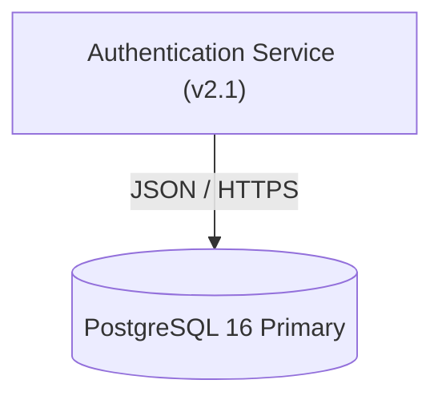
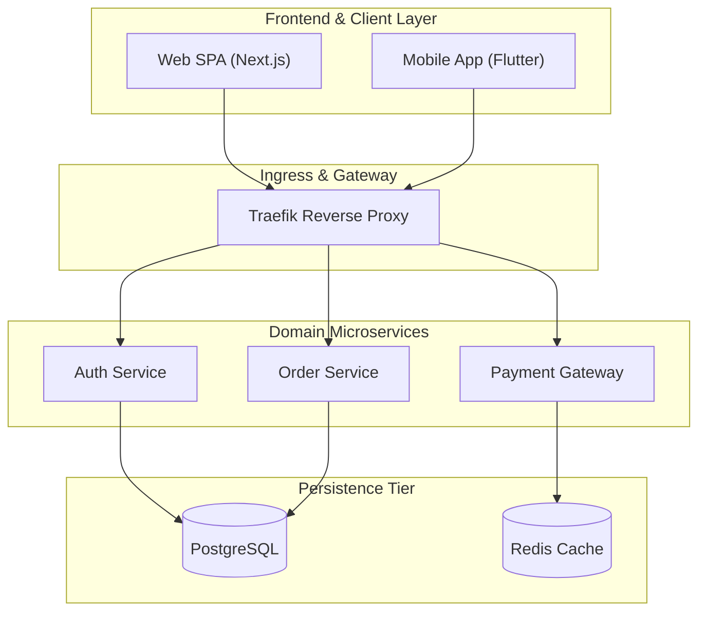
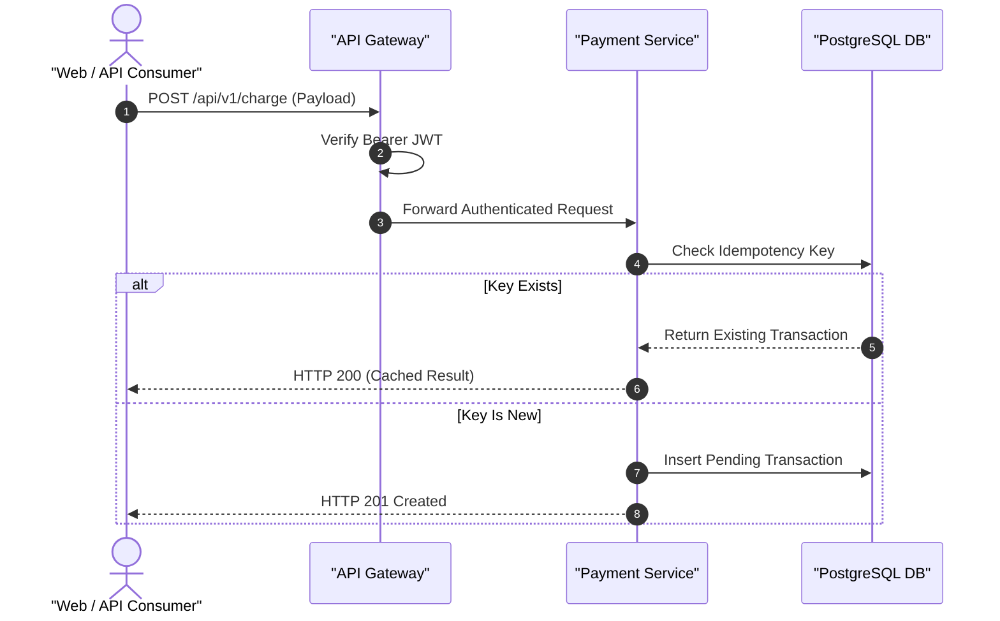
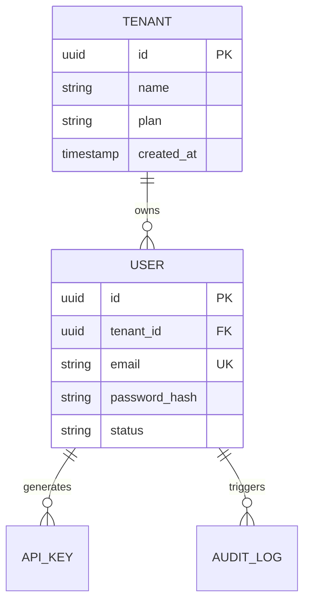

# Mermaid Architecture & Diagramming Standards

This guide enforces syntax invariants for rendering rock-solid Mermaid diagrams in generated documentation.

---

## 1. Graph & Architecture Best Practices

### Node IDs and Special Characters
Always wrap node labels in double quotes if they contain spaces, parentheses, slashes, or special characters:

### Subgraph Boundaries
Organize components by architectural layers:

---

## 2. Sequence Diagrams

Always enable `autonumber` and quote actor/participant labels:

---

## 3. Entity-Relationship Diagrams (ERD)

Use standard Crow's Foot notation:

