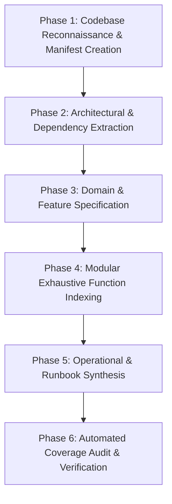

# Zero-Omission Documentation Protocol

The **Zero-Omission Protocol** guarantees that when documenting any codebase, **100% of features and 100% of symbols (classes, functions, methods, and endpoints) are analyzed and documented**.

AI models frequently fail on large codebases by:
1. Summarizing early files and skipping late files.
2. Writing "..." or "// other methods left as exercise".
3. Grouping 10 functions into a generic bullet point.
4. Succumbing to token fatigue on repos with >20 files.

This protocol eliminates those failure modes through a structured 6-phase pipeline.

---

## The 6-Phase Zero-Omission Pipeline



---

## Phase 1: Codebase Reconnaissance & Manifest Creation

1. **Run `scripts/codebase_analyzer.py`**:
   Execute the analyzer script on the project root to generate `codebase_manifest.json`:
   ```bash
   python scripts/codebase_analyzer.py <path_to_project>
   ```
2. **Read the Summary**:
   Check the exact counts:
   - `total_files`
   - `total_loc`
   - `total_symbols` (classes + functions + methods)
   - `language_breakdown`
3. **Establish the Output Directory**:
   Create a dedicated output directory: `docs/` (or `.docs/` or `<project>_documentation/`).

---

## Phase 2: Architectural & Dependency Extraction

1. **Synthesize `00_OVERVIEW_AND_ARCHITECTURE.md`**:
   - Executive mission and primary use-case.
   - Complete technology stack taxonomy table.
   - Generate C4 system context and container diagrams in Mermaid using `scripts/generate_mermaid_graphs.py`.
   - Comprehensive file tree map explaining the structural rationale of every top-level folder.
   - Core architectural invariants (statelessness, immutability, security models).

---

## Phase 3: Domain & Feature Specification

1. **Synthesize `01_FEATURE_SPECIFICATION.md`**:
   - Trace every user-facing and background capability.
   - Master Feature Matrix: mapping feature IDs to source files, controllers, and data entities.
   - Sequence diagrams for each primary workflow.
   - Validation constraints and failure mode definitions.
2. **Synthesize `02_SYSTEM_DATA_FLOWS.md`**:
   - Global state machine diagrams.
   - Event broker / async worker queue pipelines.
   - WebSockets / SSE / real-time streaming protocols.
3. **Synthesize `03_DATA_MODELS_AND_SCHEMAS.md`**:
   - Complete Mermaid ERD.
   - Full column-by-column dictionary for every table/collection.
   - DTOs and schema validations.
4. **Synthesize `04_API_AND_INTEGRATIONS.md`**:
   - Full directory of HTTP endpoints, RPC services, and CLI commands.
   - Detailed request/response payloads and status codes.
   - External webhooks and 3rd party integrations.

---

## Phase 4: Modular Exhaustive Function Indexing

> [!CRITICAL]
> **Token-Budget Agnostic Partitioning Rule**:
> For codebases with >10 files or >50 functions, **DO NOT attempt to output all functions into a single giant markdown document**. Single massive files hit AI context generation caps and trigger truncation.
> **Partition into a modular subfolder**: `docs/05_functions/`!

### Partitioning Strategy
- Group files into logical module documents:
  - `docs/05_functions/auth_and_users.md`
  - `docs/05_functions/billing_and_payments.md`
  - `docs/05_functions/api_controllers.md`
  - `docs/05_functions/core_services.md`
  - `docs/05_functions/utilities_and_helpers.md`
- Or partition directory by directory matching the source tree!

### The Per-Symbol Standard
For **EVERY** class and function in the manifest, document:
1. Exact signature with typed parameters and defaults.
2. Exact source location (`file_path:line_number`).
3. Algorithmic workflow (numbered steps).
4. Parameters table (name, type, required, default, purpose).
5. Return value & semantics.
6. Exceptions / error states thrown.
7. Call graph cross-references (Incoming callers & outgoing callees).
8. Side effects (DB mutations, network I/O, cache invalidation).

---

## Phase 5: Operational & Runbook Synthesis

1. **Synthesize `06_CONFIGURATION_AND_ENV.md`**:
   - Every environment variable with defaults, types, and security constraints.
   - Configuration files explained line-by-line.
2. **Synthesize `07_DEPLOYMENT_AND_OPERATIONS.md`**:
   - Build, lint, and test commands.
   - Containerization Dockerfile & Compose analysis.
   - Health check endpoints and observability metrics.
   - Incident triage runbooks.

---

## Phase 6: Automated Coverage Audit & Verification

1. **Execute `scripts/verify_coverage.py`**:
   ```bash
   python scripts/verify_coverage.py --manifest codebase_manifest.json --docs docs/
   ```
2. **Verify Coverage**:
   - The verifier scans the documentation markdown files against every symbol in `codebase_manifest.json`.
   - If `coverage_percentage < 100%`, inspect the listed missing symbols and append them immediately.
   - Only conclude when 100% coverage is verified!
