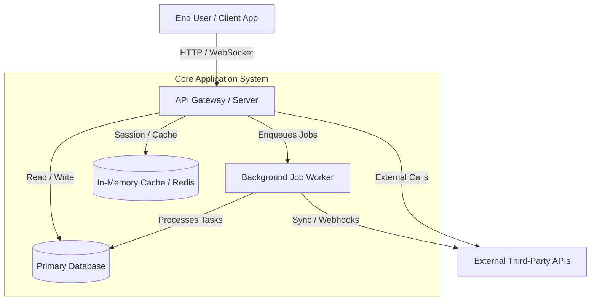

# [Project Name] — System Overview & Architecture

> **Document ID**: `00_OVERVIEW_AND_ARCHITECTURE`  
> **Classification**: Comprehensive Technical Architecture Document  
> **Generated By**: Full-Project Documenter Skill

---

## 1. Executive Summary & Purpose

- **Project Mission**: [State the exact primary objective and business value of the codebase]
- **Target Audience / End Users**: [Specify who interacts with the system: Developers, Enterprise Users, Consumers, Automated Agents]
- **Core Value Proposition**: [Explain key operational capabilities provided by this system]

---

## 2. Technology Stack Taxonomy

| Layer | Technology / Framework | Version | Purpose / Role |
| :--- | :--- | :--- | :--- |
| **Runtime / Language** | [e.g. Node.js / TypeScript, Python, Go] | [e.g. 20.x, 3.11] | Core execution engine |
| **Application Framework** | [e.g. Next.js, FastAPI, Spring Boot] | [Version] | Web server, routing, middleware |
| **State Management / UI** | [e.g. React, TailwindCSS, Redux] | [Version] | Frontend presentation & client state |
| **Database / Persistence** | [e.g. PostgreSQL, Redis, MongoDB] | [Version] | Primary data store & caching |
| **ORM / Query Engine** | [e.g. Prisma, SQLAlchemy, GORM] | [Version] | Schema management and DB access |
| **Asynchronous & Queues**| [e.g. Celery, BullMQ, Kafka] | [Version] | Background task processing |
| **Authentication & Sec** | [e.g. OAuth2, JWT, Auth0] | [Version] | Identity and access control |
| **Build & Tooling** | [e.g. Turborepo, Vite, Poetry, Cargo]| [Version] | Dependency and build orchestration |

---

## 3. High-Level Architectural Topology (C4 Model)

### 3.1 System Context Diagram


### 3.2 Modular Boundaries & Layer Responsibilities
- **Presentation / API Layer**: [Controller logic, route handlers, input validation, authentication guards]
- **Domain / Service Layer**: [Business rules, workflow engines, transaction management]
- **Data Access Layer (DAL)**: [Repositories, ORM entities, raw SQL queries, cache wrappers]
- **Integration Layer**: [HTTP clients, RPC stubs, message queue publishers/subscribers]
- **Cross-Cutting Concerns**: [Structured logging, error handling, telemetry, tracing]

---

## 4. Repository Directory Structure & File Map

```text
[project-root]/
├── [src or module_a]/        # [Description and core responsibilities]
├── [module_b]/               # [Description and core responsibilities]
├── [config/ or infra/]/       # [Configuration and infrastructure definitions]
└── [tests/]/                 # [Test suites and mocks]
```

### Directory Rationale
- **`[Path 1]`**: [Why this directory exists, what patterns it enforces, and guidelines for adding code here]
- **`[Path 2]`**: [Why this directory exists, what patterns it enforces, and guidelines for adding code here]

---

## 5. Architectural Invariants & Design Principles

1. **[Principle 1, e.g., Strict Dependency Inversion]**: [Explain rule]
2. **[Principle 2, e.g., Stateless API Scaling]**: [Explain rule]
3. **[Principle 3, e.g., Idempotent Event Handlers]**: [Explain rule]
