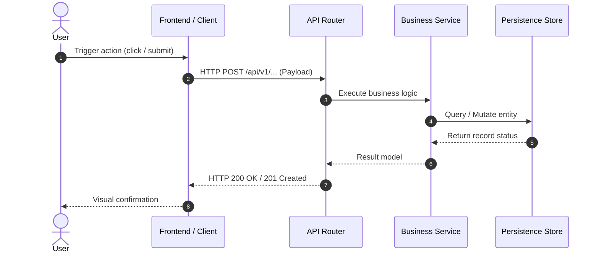

# [Project Name] — Feature Specification & Capabilities Catalog

> **Document ID**: `01_FEATURE_SPECIFICATION`  
> **Classification**: Functional Architecture & Feature Catalog  
> **Mandate**: Every user-facing and internal capability must be cataloged with end-to-end trace.

---

## Master Feature Matrix

| Feature ID | Feature Name | Domain Module | Primary Interface | Backend Handlers | Data Entities | Status |
| :--- | :--- | :--- | :--- | :--- | :--- | :--- |
| **FEAT-01** | [Feature Title] | `[src/auth]` | UI / REST `/api/v1/auth` | `AuthController.login()` | `User`, `Session` | Production |
| **FEAT-02** | [Feature Title] | `[src/billing]`| UI / Webhook `/webhook` | `StripeHandler.process()`| `Invoice`, `Subscription` | Production |

---

## Detailed Feature Specifications

### [FEAT-01]: [Feature Title]

#### 1. Description & User Stories
- **As a**: [Role / User Persona]
- **I want to**: [Perform action]
- **So that**: [Achieve concrete outcome]

#### 2. Technical Execution Flow

#### 3. Involved Source Files & Functions
- **Client Components**: `[path/to/Component.tsx]`
- **API Controllers / Routes**: `[path/to/controller.py::function_name]`
- **Domain Services**: `[path/to/service.go::MethodName]`
- **Data Repositories**: `[path/to/repository.rs::query_name]`

#### 4. Edge Cases, Failure Modes & Validation
- **Validation Rules**: [Field constraints, regex matches, schema rules]
- **Error Condition A**: [Condition, HTTP status code or Exception, user-facing error message]
- **Error Condition B**: [Concurrency conflict, retry strategy, fallback behavior]
- **Security & Permissions**: [Required roles, scopes, rate limits]

---

<!-- Repeat [FEAT-XX] for EVERY single feature detected across the codebase -->
