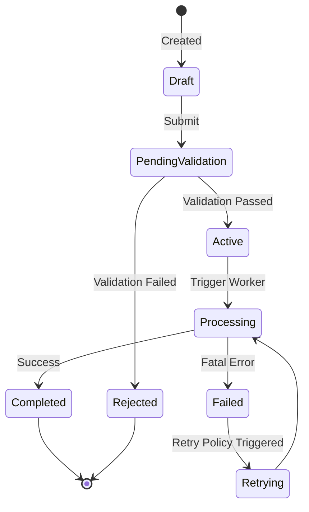
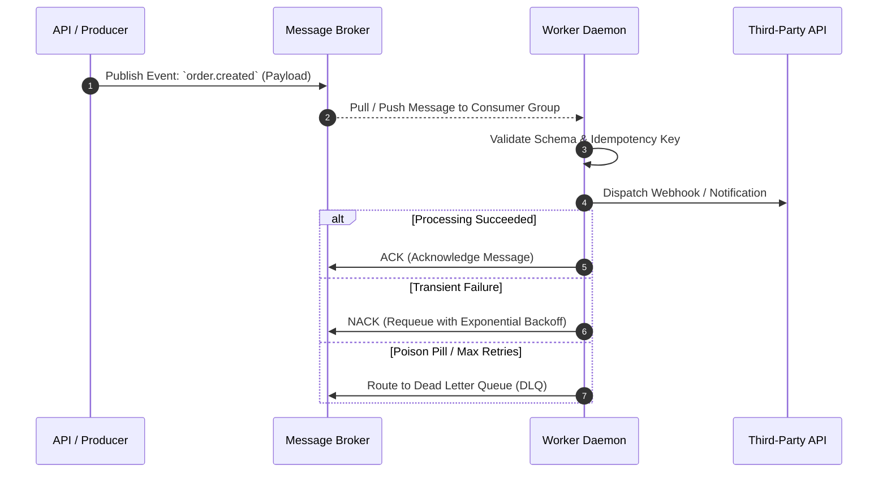

# [Project Name] — System Data Flows, State Machines & Pipelines

> **Document ID**: `02_SYSTEM_DATA_FLOWS`  
> **Classification**: Dynamic Interaction & Lifecycle Specifications  
> **Purpose**: Documents all asynchronous flows, state transitions, event publishers/subscribers, and data pipelines.

---

## 1. Global State Transition Diagrams

### [Entity / Lifecycle State Machine, e.g., Order / Job / User Lifecycle]

---

## 2. Event-Driven & Asynchronous Data Pipelines

### Event Bus / Queue Topology
- **Message Broker**: [e.g. Redis Pub/Sub, RabbitMQ, Kafka, AWS SQS]
- **Dead Letter Queue (DLQ) Strategy**: [Retry counts, backoff multipliers, alert routing]

---

## 3. Real-Time & Streaming Protocols (WebSockets / SSE / gRPC)

- **Connection Handshake**: [Auth tokens, query headers, protocol negotiation]
- **Heartbeat & Keep-Alive**: [Ping-pong interval, timeout threshold]
- **Channel / Topic Multiplexing**: [Subscribed topics, message formats]

---

## 4. Cache & Synchronization Strategy

- **Cache Layer**: [Redis, Memcached, Local LRU]
- **Eviction / Invalidation Policy**: [Cache-aside, Write-through, TTL values, Tag invalidation]
- **Race Condition Mitigations**: [Distributed locking via Redlock, optimistic concurrency control]
