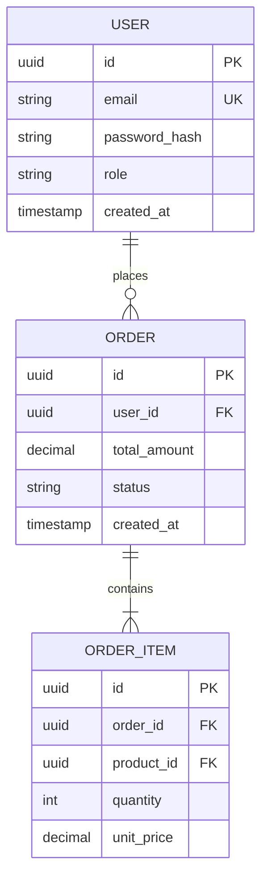

# [Project Name] — Data Models, Database Schemas & DTOs

> **Document ID**: `03_DATA_MODELS_AND_SCHEMAS`  
> **Classification**: Data Architecture & Entity Encyclopedia  
> **Requirement**: Complete mapping of every table, collection, schema, relation, index, and DTO.

---

## 1. Entity-Relationship Diagram (ERD)



---

## 2. Exhaustive Entity & Table Dictionary

### Entity: `[EntityName]` (Table / Collection: `[table_name]`)
- **Defined In**: `[path/to/schema_or_model_file]`
- **Primary Key**: `[field_name]` (`[Type]`)
- **Indexes**:
  - `idx_field_name` (BTREE, Unique: true/false)

#### Field Dictionary

| Column / Field | Type | Nullable | Default | Constraints | Description |
| :--- | :--- | :--- | :--- | :--- | :--- |
| `id` | UUID / String | No | `gen_random_uuid()` | Primary Key | Global unique identifier |
| `[field_name]` | [Type] | [Yes/No] | [Default] | [Foreign Key / Unique / Check] | [Detailed semantics] |

#### Relationships & Foreign Keys
- `[field_id]` -> References `[OtherTable].[id]` (ON DELETE CASCADE)

---

## 3. Data Transfer Objects (DTOs) & Request/Response Models

### DTO: `[CreateResourceDTO]`
- **Source File**: `[path/to/dto_file]`
- **Validation Engine**: [e.g. Zod, Pydantic, class-validator]

```typescript
// Or equivalent language definition
export interface CreateResourceDTO {
  title: string;        // Min 3, Max 120 chars
  amount: number;       // Positive float
  tags?: string[];      // Optional array of tags
}
```

---

## 4. Migrations & Schema Versioning History

| Migration Version | Name / File | Purpose | Rollback Strategy |
| :--- | :--- | :--- | :--- |
| `0001` | `0001_init_schema.sql` | Base tables creation | Drops newly created tables |
